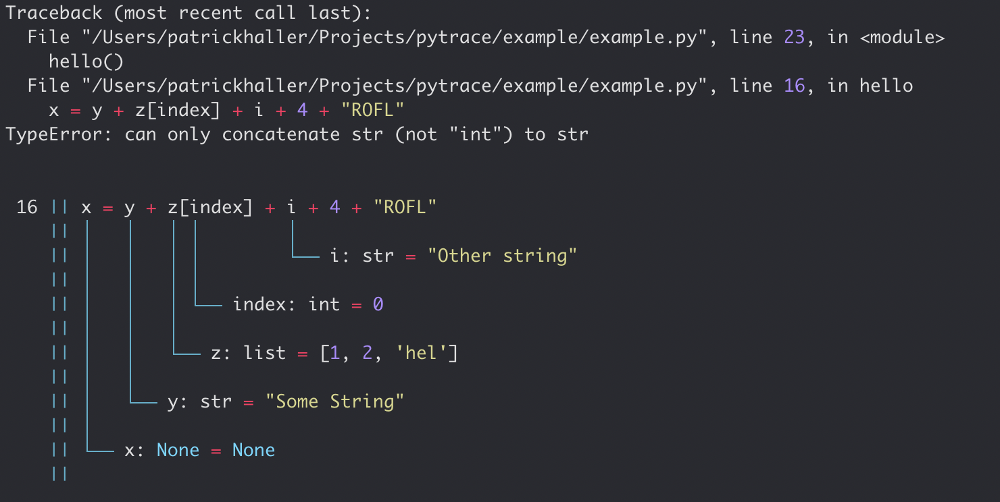

Better runtime error messages!

Are you also constantly seeing the runtime error message the python interpreter is giving you? It lacks some color and more debug information!

Get some good looking error tracebacks and beautifuly formatted last line with all its last values before you crashed the program.



What `frosch` is doing under the hood is basically following:

```python
def _hook():
    """Overwrite sys.excepthook"""
    sys.excepthook = pytrace_excepthook
```

We just overwrite the `sys.excepthook`, which is the function called, when the python program
provokes a runtime error. This is catched by the `cpython` runtime and propagated through it.


You can find the source [here](https://github.com/HallerPatrick/frosch)
